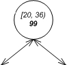

Se ha empleado un arbol binario de intervalos (**Interval Tree**)

    5A.cpp - Programa principal que lee los intervalos, construye el árbol y calcula el resultado del primer reto.
    5B.cpp - Programa principal que lee los intervalos, gestiona las intersecciones para construir un arbol libre de ellas y con un dfs(Depth First Search) resolver el segundo reto.
    IntervalTree.h - Declaración de la estructura Interval (Struct), Node (Struct) y IntervalTree (Class).
    IntervalTree.cpp - Implementación completa del árbol de intervalos y sus operaciones.

### Intervalo: [min, max]
```cpp
    struct Interval{
        long long min;
        long long max;
    };
```

### Nodo


```cpp
    struct Node{
        Interval i;
        long long maximum;
        Node *left, *right;
    };
```

### Arbol binario de intervalos (Interval tree)

Se implementa con punteros como la mayoria de las estructuras de datos de nodos

```cpp
    class IntervalTree{
        private:
            Node *root;
            int n; //Tamaño del arbol (Numero de intervalos)
    };
```
